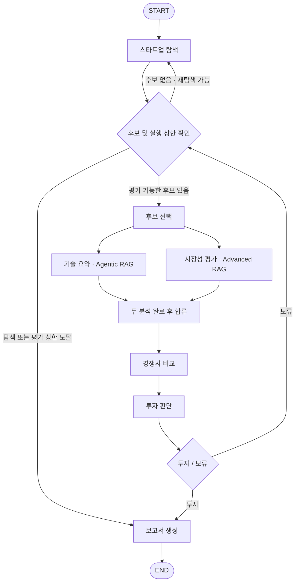

# AI Startup Investment Evaluation Agent

Energy(AI 기반 전력 수요 예측·발전/배터리 운영·전력망 관리) 스타트업의 투자 가능성을 자동으로 평가하는 LangGraph 기반 Multi-Agent 시스템입니다. 웹 검색과 문서 기반 RAG로 기술력·시장성·경쟁력을 분석하고, 평가 기준에 따라 투자 여부를 판단해 5페이지 이내의 투자 보고서 PDF를 생성합니다.

## Overview

- **Objective**: Energy AI 스타트업의 기술력, 시장성, 경쟁력, 팀 역량을 근거 기반으로 분석하고 투자 적합성을 평가합니다.
- **Method**: LangGraph Multi-Agent, Agentic RAG(기술 요약), Advanced RAG(시장성 평가)를 결합합니다.
- **대상 기업**: 비상장, Seed~Series C 단계이며 M&A·IPO 등 Exit가 완료되지 않은 스타트업입니다.
- **분석 분야**: 전력 수요 예측, 발전 예측·가상발전소(VPP), 배터리(ESS) 운영, 전력망 관리입니다.
- **산출물**: 투자 추천 보고서 또는 전체 후보 보류 보고서, 검토용 Markdown, 실행 로그입니다.

상세 설계와 협업 기준은 [구현 명세서](docs/IMPLEMENTATION_PLAN.md)와 [작업 분배표](docs/WORK_DIVISION.md)를 참고하세요.

## Features

- **스타트업 자동 발굴**: 웹 검색으로 후보를 수집하고 투자 단계·상장 여부·Exit 여부를 검증합니다.
- **기술·시장 병렬 분석**: 기술 요약과 시장성 평가를 동시에 수행한 뒤 경쟁사 비교 단계에서 결과를 통합합니다.
- **Agentic RAG**: 검색 문서의 관련성을 평가하고, 필요하면 질의를 최대 2회 재작성하거나 웹 검색으로 근거를 보완합니다.
- **Advanced RAG**: 국가·세그먼트 필터, BM25와 밀집 검색, RRF, 리랭킹, 컨텍스트 압축으로 시장 분석에 필요한 근거를 추출합니다.
- **문서 기반 분석**: 기술 문서 3종과 시장 보고서 3종의 지정 페이지를 활용하며, 인제스트 시 총 200페이지 제한을 검사합니다.
- **일관된 투자 판정**: LLM이 11개 항목을 채점하고 코드가 가중 점수 합산·탈락 조건·최종 판정을 처리합니다.
- **후보 재평가 흐름**: 보류 시 다음 후보를 평가하고, 대기열이 소진되면 재탐색합니다. 최초 탐색 포함 최대 3회, 심층 평가 최대 8개 기업으로 실행을 제한합니다.
- **보고서 자동 생성**: SUMMARY, 분석 본문, 비교표·점수표, 실제 활용 자료의 REFERENCE를 포함한 5페이지 이내 PDF를 생성합니다.
- **실행 기록 및 캐시**: 검색 결과와 시장 분석을 재사용하고 평가 이력·출처·로그를 저장합니다.

## Tech Stack

| 영역 | 기술 및 구성 |
|---|---|
| Language | Python 3.11 |
| Framework | LangGraph `StateGraph`, 조건부 라우팅, 병렬 실행 |
| LLM / Generator | `langchain-openai`의 `ChatOpenAI`, `LLM_MODEL` 환경변수로 지정 |
| LLM / Judge | `ChatOpenAI`, `JUDGE_MODEL` 환경변수로 지정 |
| Structured Output | Pydantic v2 |
| Web Search | Tavily |
| PDF Loader | pypdf |
| Vector Store | Chroma (`tech_docs`, `market_docs`) |
| Embedding | `BAAI/bge-m3` — 오픈소스, 로컬 또는 Hugging Face Inference API |
| Hybrid Search | BM25 + 밀집 검색 + RRF, 한국어 토큰화에 kiwipiepy 사용 |
| Reranker | `BAAI/bge-reranker-v2-m3` |
| PDF Renderer | fpdf2 + NanumGothic |
| Test | pytest |

임베딩은 동일 청크·질의로 `BAAI/bge-m3`, `Qwen/Qwen3-Embedding-0.6B`, `intfloat/multilingual-e5-large`를 비교합니다. 평가 지표는 **Hit Rate@5**와 **MRR**이며, 평가 스크립트의 측정 결과는 `outputs/embedding_eval.md`에 저장됩니다.

## Agents

| 에이전트 | 역할 | 근거 수집 방식 |
|---|---|---|
| 스타트업 탐색 | 후보 발굴, 요건 검증, 유망도 정렬 | 웹 검색 |
| 기술 요약 | 핵심 기술·제품·성능·TRL·팀 역량 분석 | Agentic RAG + 웹 검색 |
| 시장성 평가 | 시장 규모·성장성·수요·정책 및 규제 분석 | Advanced RAG |
| 경쟁사 비교 | 경쟁사 3~5곳 비교, 차별성·진입장벽·사업 실적 분석 | 웹 검색 + 기술·시장 분석 결과 |
| 투자 판단 | 11개 평가 항목 채점 및 투자·보류 판정 | 분석 결과 + 평가 루브릭 |
| 보고서 생성 | 판정에 따른 보고서 작성 및 PDF 출력 | 평가 결과 + 실제 활용 출처 |

후보 선택은 LLM을 사용하지 않는 별도 유틸리티 노드입니다. 대기열에서 후보를 선택하고 기업별 분석 상태를 초기화합니다.

투자 판단은 다음 기준을 적용합니다.

- 항목별 0~10점을 가중 합산해 총 100점으로 평가합니다.
- 총점 **70점 이상**이고 필수 탈락 조건이 없으면 **투자**, 그 외에는 **보류**입니다.
- **창업팀 역량** 또는 **규제·정책 위험**이 3점 이하면 총점과 관계없이 보류합니다.
- 공개 정보가 부족한 항목은 5점과 정보 부족 표시를 함께 기록하고, 보고서에 분석의 한계를 명시합니다.

## Architecture



후보·실행 상한 확인과 투자·보류 분기는 조건부 라우팅으로 처리합니다. 기술 요약과 시장성 평가가 모두 완료되어야 경쟁사 비교를 실행합니다.

기술 요약의 Agentic RAG는 `검색 → 관련성 평가 → 응답 생성`을 기본 흐름으로 사용합니다. 관련 문서가 부족하면 `질의 재작성 → 재검색`을 최대 2회 수행하고, 이후 웹 검색으로 보완합니다. 기업 고유 정보는 웹 근거로, 업계 기술 수준과 상용화 기준은 RAG 문서로 보완합니다.

시장성 평가의 Advanced RAG는 `국가·세그먼트 필터 → BM25 + 밀집 검색 → RRF → 리랭킹 → 문장 압축` 순서로 동작합니다. 동일 국가·세그먼트의 분석은 캐시로 재사용합니다.

보고서는 두 경로로 생성합니다.

- **투자 추천**: SUMMARY → 기업 및 사업 개요 → 시장 및 경쟁 분석 → 기업 역량 및 리스크 → 종합 투자 평가 → REFERENCE
- **전체 보류**: SUMMARY → 평가 대상 및 선정 과정 → 후보별 평가 결과 비교 → 주요 보류 사유 및 시장 환경 → 분석의 한계 → REFERENCE

## Directory Structure

```text
.
├── app.py                      # 실행 진입점
├── config.py                   # 환경변수, 경로, 실행 상한
├── state.py                    # 공유 State 및 reducer
├── schemas.py                  # Pydantic 데이터 스키마
├── graph/                      # 그래프 구성 및 조건부 라우팅
├── agents/                     # 6개 에이전트 및 후보 선택 노드
├── rag/                        # 인제스트, 임베딩, Agentic / Advanced RAG
├── tools/                      # LLM, 웹 검색, 출처 처리
├── report/                     # 보고서 템플릿 및 PDF 조판
├── prompts/                    # 에이전트별 프롬프트
├── config/
│   ├── docs.yaml               # 문서 메타데이터 및 사용 페이지
│   └── rubric.yaml             # 평가 항목, 가중치, 탈락 조건
├── data/
│   ├── docs/tech/              # 기술 문서
│   ├── docs/market/            # 시장 보고서
│   ├── seed_candidates.json    # 시드 후보
│   ├── eval/                   # 임베딩 평가셋
│   └── vectorstore/            # Chroma 저장소
├── eval/                       # 임베딩 성능 평가
├── assets/fonts/               # 한글 폰트 및 라이선스
├── docs/                       # 설계 및 작업 분배 문서
├── outputs/                    # 보고서, 평가 결과, 로그, 캐시
├── tests/                      # 채점, 라우팅, 출처 처리 테스트
├── requirements.txt
├── .env.example
└── README.md
```

## Usage

1. Python 3.11 환경에서 저장소 루트에 가상환경을 만들고 활성화합니다.

   ```bash
   python -m venv .venv
   ```

   macOS / Linux:

   ```bash
   source .venv/bin/activate
   ```

   Windows PowerShell:

   ```powershell
   .venv\Scripts\Activate.ps1
   ```

2. 의존성을 설치합니다.

   ```bash
   pip install -r requirements.txt
   ```

3. `.env.example`을 `.env`로 복사하고 API 키와 모델명을 입력합니다.

   ```dotenv
   OPENAI_API_KEY=your_openai_api_key
   TAVILY_API_KEY=your_tavily_api_key
   LLM_MODEL=your_generation_model
   JUDGE_MODEL=your_judge_model
   EMBEDDING_BACKEND=local
   ```

   `EMBEDDING_BACKEND=hf_api`를 사용할 때는 `HF_TOKEN`도 설정합니다. 생성·평가 모델은 `temperature=0`으로 호출합니다. `.env`는 버전 관리에 포함하지 않습니다.

4. `config/docs.yaml`에 지정된 PDF를 `data/docs/tech/`, `data/docs/market/`에 준비하고 벡터스토어를 생성합니다.

   ```bash
   python -m rag.ingest
   ```

   지정 페이지 합계가 200페이지를 초과하면 인제스트를 중단합니다. 문서나 페이지 범위를 변경한 경우 `python -m rag.ingest --rebuild`로 다시 생성합니다.

5. 전체 평가를 실행합니다.

   ```bash
   python app.py
   ```

   웹 발굴 대신 시드 후보를 사용하려면 `python app.py --seed-only`, 검색 캐시를 무시하려면 `python app.py --no-cache`를 사용합니다. 시드 모드에서도 기업 분석을 위한 LLM 호출과 웹 검색은 사용합니다.

실행 결과는 `outputs/`에 저장됩니다.

| 파일 | 내용 |
|---|---|
| `report_YYYYMMDD_HHMM.pdf` | 최종 투자 평가 보고서 |
| `report_YYYYMMDD_HHMM.md` | 검토용 보고서 원문 |
| `run_log.json` | 평가 이력, 점수, 판정, 출처, 실행 로그 |
| `discovery_round{n}.json` | 탐색 회차별 후보 발굴 결과 |
| `graph.mmd` | 전체 그래프의 Mermaid 표현 |
| `agentic_rag.mmd` | Agentic RAG 서브그래프의 Mermaid 표현 |

테스트와 임베딩 평가는 다음 명령으로 실행합니다.

```bash
pytest
python -m eval.embedding_eval
```

테스트는 점수 계산·70점 경계·필수 탈락 조건, 후보 반복·재탐색·종료 라우팅, REFERENCE 형식·중복 제거·기업별 필터를 검증합니다.

## Contributors

담당 구분은 [작업 분배표](docs/WORK_DIVISION.md)를 따릅니다.

- **A**: 공통 스키마·State, LangGraph 그래프 및 라우팅, 스타트업 탐색, 실행 스크립트, 통합 및 README
- **B**: RAG 문서 인제스트, 오픈소스 임베딩, Advanced RAG, 시장성 평가, 임베딩 성능 평가
- **C**: Agentic RAG 서브그래프, 기술 요약, 경쟁사 비교, 기술 문서 평가셋
- **D**: 투자 판단 루브릭 및 채점, 보고서 생성, PDF 조판, REFERENCE 처리
